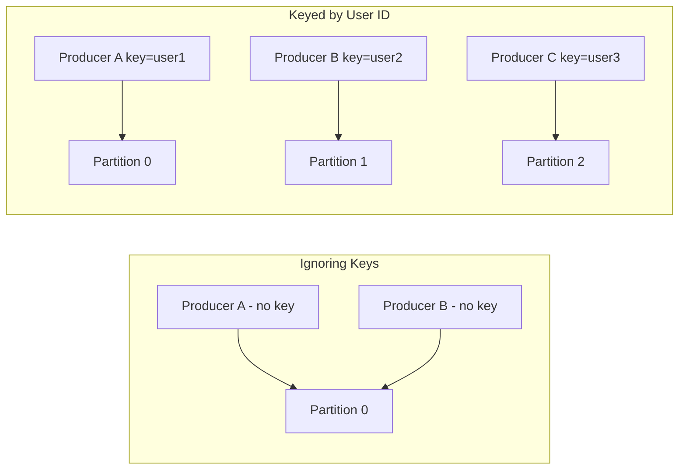

# 📝 Mistake #2 — Ignoring Message Key Design

In Kafka, every message can have an optional **key**. And that key **matters a lot**.

Ignoring or poorly designing your message key is one of the most common and subtle mistakes that teams make when using Kafka — leading to **partition imbalance**, **ordering issues**, and **unexpected consumer behavior**.

This section explains why key design is critical, and how to choose effective keys based on real-world scenarios.

---

## 🔴 The Problem

Many developers:

- Send Kafka messages **without a key**
- Use meaningless/random UUIDs as keys
- Hardcode a single key for all messages (e.g., `"constant"`)

### This leads to:
- All messages going to a single partition (hot spot)  
- No ordering guarantees across related messages  
- Poor parallelism across consumers  
- Uneven broker workload  

> 💥 Even in large clusters, improper keying leads to 80% of messages landing on 1 or 2 partitions. That kills throughput.

---

## 🧯 Why It’s a Problem

Kafka’s partitioning model relies on **keys** to determine which partition a message goes to.

If the key is:
- ❌ Missing → Round-robin behavior (no control over where it lands)
- ❌ Constant → All messages go to one partition (bottleneck)
- ❌ Random → Poor ordering + low cache/locality hit rate

This leads to:
- Backlogged partitions  
- Broker storage imbalance  
- Performance degradation under load  
- Inability to guarantee ordering for critical flows (e.g., user updates)

---

## ✅ How to Avoid / Fix It

The key takeaway: **design your Kafka keys purposefully**, based on the **domain entity** you're tracking.

Here are the strategies.

---

### 1. Key by Natural Domain ID

If you’re tracking a user, order, product, or session — use its ID as the Kafka key.

```python
# Good
producer.send("user-activity", key="user_123", value="clicked button")

# Bad
producer.send("user-activity", value="clicked button")  # no key
```

Why it works:
- All messages for the same user go to the same partition
- Ensures ordering across a user's event stream
- Simplifies stateful processing with Kafka Streams


### 2. Key for Load Distribution

If you have thousands of messages per second for a small set of users/products, create derived keys to spread load.

```python
def get_partition_key(user_id):
    # Custom hash-based sharding
    return f"user_{user_id % 10}"  # pseudo-shard key
```
This balances:
Load across partitions
Hot users/products from overwhelming a single consumer

> 🎯 Goal: Maintain ordering within a group, while spreading traffic across partitions.


### 3. Always Specify Keys Explicitly

Make it part of your Kafka publishing contracts:
- Enforce schema like: `{ key: string, value: {...} }`
- Include `key.serializer` config in all producer clients
- Add tests or lint checks to catch keyless publishing


### 4. Validate Key Distribution in Production

Use built-in metrics or tools like:
- kafka-topics.sh --describe
- Kafka JMX metrics
- [Burrow](https://github.com/linkedin/Burrow) or [Cruise Control](https://github.com/linkedin/cruise-control)
- Grafana dashboards showing records per partition

```bash
kafka-run-class kafka.tools.GetOffsetShell --topic your-topic --time -1 --broker-list localhost:9092
```
Look for imbalanced partitions — it's a key design issue.

## 🖼️ Diagram — Good vs Bad Keying



---

## 🧰 Checklist for Teams

- [ ] Use domain entity (user/order/product ID) as the Kafka key  
- [ ] Avoid sending messages with null or constant keys  
- [ ] Validate key distribution with Kafka partition metrics  
- [ ] Use derived keys for load balancing in high-throughput cases  
- [ ] Make key enforcement part of your publishing contract  

---

## 📚 References & Further Reading

- [Kafka Docs: Message Keys & Partitioning](https://kafka.apache.org/documentation/#producers)  
- [Confluent Blog: Designing Event Keys](https://www.confluent.io/blog/put-semantics-in-your-event-streams/)  
- [Kafka Streams Ordering Guarantees](https://kafka.apache.org/30/documentation/streams/developer-guide/dsl-api.html#data-locality)

