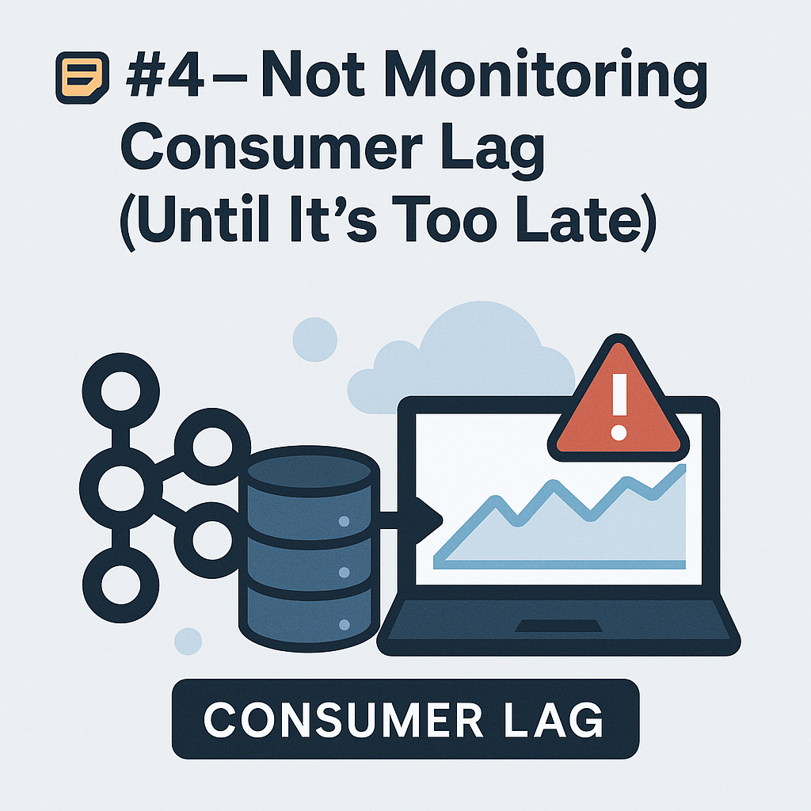

# 📝 Mistake #4 — Not Monitoring Consumer Lag (Until It’s Too Late)



Consumer lag is one of the **most important health metrics** in a Kafka-based architecture — yet many teams ignore it until problems are visible to users.

---

## 🔴 The Problem

Kafka guarantees **at-least-once delivery**, but it doesn’t guarantee _timely_ processing. A consumer can fall behind silently, causing:

- Stale data in dashboards  
- Delayed order processing  
- Event-driven systems not reacting on time  
- Reprocessing jobs missing SLA windows

> ⚠️ If your consumers aren’t reading fast enough, your pipeline is silently failing.

---

## 🧯 Why It’s a Problem

When lag builds up:

- Memory builds on the broker side  
- Retention limits kick in → data loss  
- Alerts trigger late → debugging becomes hard  
- Business users lose trust in the platform  
- Consumer groups may crash trying to “catch up”

**Symptoms include:**

- Data freshness issues  
- Metrics dashboards going blank  
- Delayed microservices response  
- High disk usage on brokers

---

## ✅ How to Avoid / Fix It

---

### 1. **Track Lag per Topic, per Consumer Group**

Use `kafka-consumer-groups.sh` or Prometheus exporters to track lag continuously.

```bash
kafka-consumer-groups.sh \
  --bootstrap-server <BROKER> \
  --describe \
  --group <YOUR_GROUP>
```
Pay attention to:

- CURRENT-OFFSET
- LOG-END-OFFSET
- LAG

This tells you how far behind each partition is.

### 2. Set Up Real-Time Dashboards and Alerts

Track lag in Grafana using Prometheus metrics from your Kafka setup (e.g., Burrow, Cruise Control, or Confluent Control Center).

🚨 Alert when lag crosses a threshold (e.g., 10,000 messages or 5 minutes)

Sample dashboard:
```yaml
[Consumer Lag Heatmap]
 ├─ Topic: orders
 ├─ Group: payment-service
 ├─ Lag: 21,387
 ├─ Status: WARNING (red)
```

### 3. Implement Dead Letter Queues for Laggy Consumers

Sometimes messages cause failures that block progress (e.g., bad schema, null pointer). Use a DLQ (Dead Letter Queue):

- If a message fails 3 times → push it to a separate topic
- Log and notify developers
- Keep the main pipeline moving

### 4. Auto-Scale or Parallelize Consumers

If you’re constantly lagging:

- Add more consumer instances
- Increase partitions (if feasible)
- Use batching + parallel processing frameworks (Flink, Spark, Kafka Streams)

Sample fix in Kubernetes:
```yaml
# Scale payment processor consumers from 3 to 6
replicas: 6
```

### 5. Use Lag Trends for Capacity Planning

Look at:
- Lag over time (is it growing linearly?)
- Rebalance duration (is it stuck on high lag?)
- Lag spikes during peak hours?

Use this to forecast whether your cluster can handle expected traffic surges.

## 🧰 Checklist for Teams

- Monitor consumer lag per group/topic/partition
- Alert on abnormal lag (> 5 mins or 10k messages)
- Use DLQs to avoid stuck processing
- Autoscale consumers during peak times
- Plan capacity based on lag trends

## 📚 References

- [Kafka Docs: Monitoring Lag](https://kafka.apache.org/documentation/#consumerconfigs_auto.offset.reset)  
- [LinkedIn Burrow](https://github.com/linkedin/Burrow) — consumer lag monitoring  
- [Prometheus Kafka Exporter](https://github.com/danielqsj/kafka_exporter)  
- [Confluent Lag Alerting](https://docs.confluent.io/platform/current/control-center/index.html)

---

> 💡 **TL;DR**  
> If you’re not watching consumer lag, you’re flying blind.  
> Monitor it. Alert on it. Design for it.


