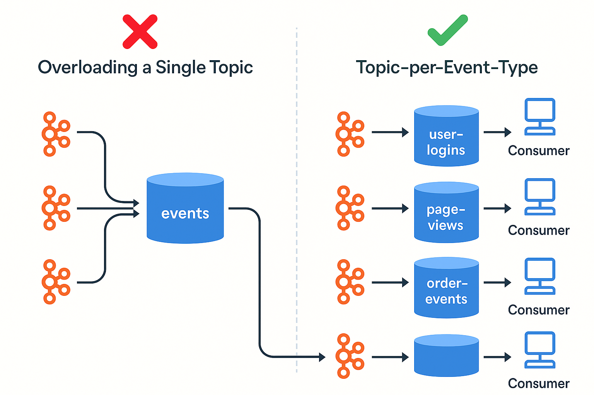

# Mistake #7 — Overloading a Single Kafka Topic



Apache Kafka is designed to handle large-scale event streams, but misusing a single topic for too many unrelated events can cause chaos for producers, consumers, and downstream analytics.

---

## The Problem

Some teams treat a Kafka topic like a “dumping ground” — publishing all types of events (user logins, purchases, page views, errors) into a single topic such as:

```
events-topic
```

This introduces several issues:

- No clear schema or contract between producers and consumers  
- Consumers must filter and parse messages to find what they need  
- Difficult to evolve schemas or reason about the topic  
- Increased risk of bugs and data loss due to serialization issues

---

## Real-World Symptoms

- Consumers fail when unexpected event types arrive  
- Filtering logic becomes complex and error-prone  
- Producers unknowingly overwrite or corrupt downstream logic  
- Teams step on each other’s toes without clear ownership of topic structure

---

## Best Practices

### 1. Use Topic-per-Event-Type or Domain

Instead of a single topic, split based on event type or business domain:

```
user-logins
page-views
order-events
error-logs
```

This separation provides clear contracts and allows schema evolution per stream.

---

### 2. Use Schemas (with Registry)

If you must use a shared topic, enforce schemas using tools like:

- Confluent Schema Registry  
- AWS Glue Schema Registry  
- Protobuf or Avro with validation  

This helps avoid consumers breaking due to incompatible message formats.

---

### 3. Document Topic Ownership & Structure

In large teams, document:

- Who owns the topic  
- What events exist  
- What each schema looks like  
- Retention, compaction, and delivery guarantees  

---

## Summary

Avoid putting all your events into one topic.  
It creates chaos, slows down consumers, and makes debugging harder.

Instead:

- Use a topic-per-type strategy  
- Enforce schemas  
- Document ownership and structure  

---

## Related Reading

- [Confluent: Event Design Best Practices](https://www.confluent.io/blog/event-design-event-schemas/)  
- [Schema Registry with Kafka](https://docs.confluent.io/platform/current/schema-registry/index.html)  
- [Data Contracts & Kafka Governance](https://martinfowler.com/articles/data-monolith-to-mesh.html)
