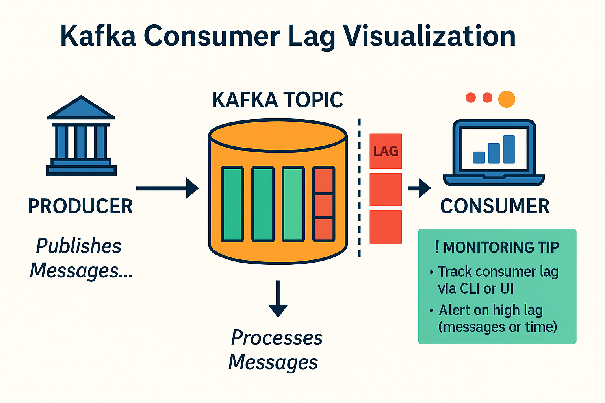

# Mistake #8 — Ignoring Consumer Lag

Consumer lag is a silent killer in Kafka systems. It's often overlooked until it causes real damage: delayed processing, stale dashboards, or even data loss.

---

## The Problem

Kafka is fast — but your consumers might not be.

If consumers fall behind, it creates a growing backlog called **lag**. If this is ignored, it can lead to:

- SLAs being missed
- Timeouts and retries
- Disk bloat (if retention is exceeded)
- Reprocessing headaches

---

## Common Causes

- Spiky or bursty data input  
- Slow deserialization or downstream systems  
- Poorly configured consumer groups  
- Insufficient parallelism or thread bottlenecks  

---

## Best Practices

### 1. Monitor Consumer Lag Proactively

Use tools like:

- Kafka’s `kafka-consumer-groups.sh`
- Confluent Control Center
- Burrow
- Prometheus + Grafana dashboards

Set up **alerts** when lag exceeds thresholds (e.g., >10k messages or >5 mins delay).

---

### 2. Scale Consumers Based on Lag

Increase the number of consumer instances when:

- Lag consistently rises
- Topic partition count allows for more parallelism
- Processing is CPU- or IO-bound

Avoid having more consumers than partitions — extra consumers will be idle.

---

### 3. Analyze and Fix Hot Partitions

If lag is high only on some partitions:

- Check for skewed key distribution
- Use more granular keys
- Consider repartitioning if necessary

---

### 4. Implement Backpressure and Dead Letter Queues

To avoid complete failure:

- Pause/resume consumption if downstream is slow  
- Route poison messages to DLQs  
- Use exponential backoff on retries  

---

## Summary

Consumer lag is not just a metric — it's a symptom. Treat it seriously.

- Monitor lag metrics  
- Tune performance bottlenecks  
- Alert before it’s too late  

Stay ahead of lag before it becomes a fire.

---

## Related Resources

- [Confluent Blog on Lag Monitoring](https://www.confluent.io/blog/kafka-fastest-messaging-system/)
- [LinkedIn's Burrow for Lag Monitoring](https://github.com/linkedin/Burrow)
- [Understanding Consumer Groups](https://kafka.apache.org/documentation/#intro_concepts_and_terms)
