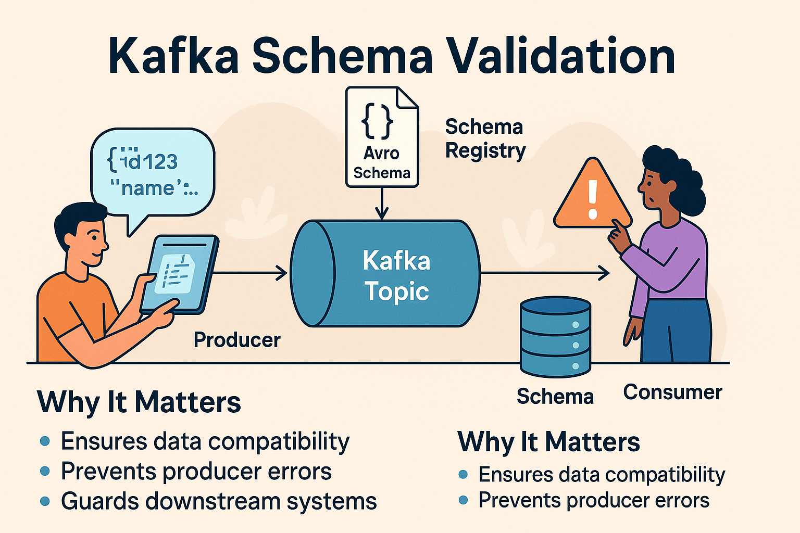

# Mistake #9 — Not Using Schema Validation

Schema evolution is powerful, but only if you enforce structure. Skipping schema validation can lead to hard-to-debug issues when downstream systems fail due to unexpected fields, types, or null values.

---

## The Problem

Many teams treat Kafka topics like schemaless event streams. While Kafka doesn't enforce schema natively, that doesn't mean you should avoid it.

Without schema validation:
- Producers might push breaking changes.
- Consumers might deserialize to incompatible formats.
- Data lineage becomes harder to manage.
- Debugging becomes reactive instead of proactive.

---

## Real-World Symptoms

- Failing deserialization on consumer side (e.g., AvroException)
- Data pipelines crash when new fields appear or expected ones go missing
- Multiple versions of events floating around with no compatibility checks

---

## Best Practices

### 1. Use Schema Registry

Adopt a schema registry like:
- Confluent Schema Registry (Apache-licensed version available)
- AWS Glue Schema Registry
- Hortonworks Schema Registry

These allow you to:
- Register schemas with compatibility checks (BACKWARD, FORWARD, FULL)
- Version schemas with traceability
- Enforce schema evolution rules

### 2. Serialize with Format Support

Use serialization formats that work well with schema registries:

- Avro (widely supported)
- Protobuf
- JSON Schema (but enforce it — don’t assume!)

Avoid plain JSON strings without schema enforcement.

### 3. Validate on Both Sides

- Producers should register and validate schema before pushing events.
- Consumers should deserialize only against known schema versions.

This avoids surprises when changes are deployed out-of-sync.

---

## Why It Matters

- Strong typing protects against data drift.
- Schemas reduce contract ambiguity between teams.
- Compatibility rules protect production jobs from crashes.
- Tools like Redpanda Console, Confluent Control Center, or OpenMetadata become more powerful with schemas.

---

## Summary

Kafka doesn't enforce structure — you should.

Adopt a schema registry. Version your contracts. Validate aggressively.

In event-driven systems, structure is safety.
