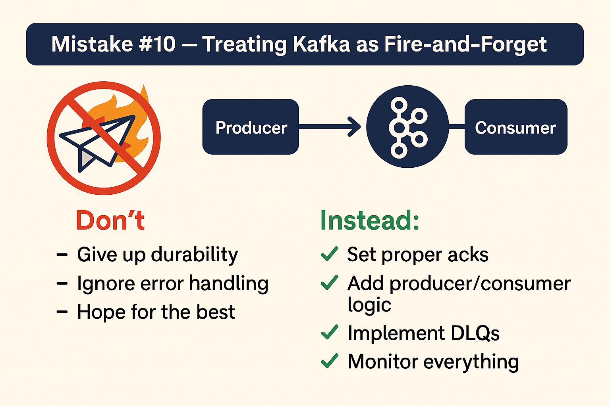

# Mistake #10 — Treating Kafka as Fire-and-Forget


One of the most common anti-patterns in event-driven architectures is treating Kafka like a black box: producers send messages and assume success without validating delivery, and consumers read without tracking failures.

Kafka offers strong durability guarantees — but only when used correctly.

---

## The Problem

Many teams use the default Kafka producer settings and never revisit them.

This often means:

- `acks=1` (or even `acks=0`)
- No error handling on failed sends
- No retries or DLQs for consumers
- Monitoring is reactive (only after something breaks)

This leads to:

- **Message loss** if a broker fails
- **Silent delivery failures**
- **Unrecoverable consumer errors**
- **Missing critical business events**

---

## Best Practices

### 1. Set `acks=all` for Producers

Ensure that data is only acknowledged when replicated to all in-sync replicas (ISR).

```python
from kafka import KafkaProducer

producer = KafkaProducer(
    bootstrap_servers='localhost:9092',
    acks='all',  # Strongest delivery guarantee
    retries=5,
    linger_ms=10
)
```

> Tradeoff: Slightly more latency, but higher durability.

---

### 2. Add Error Handling Logic

Do not treat `send()` as fire-and-forget.

Instead, handle both success and failure:

```python
def on_success(metadata):
    print(f"Message delivered to {metadata.topic} [{metadata.partition}]")

def on_error(exc):
    print(f"Delivery failed: {exc}")

producer.send('orders', b'event-data').add_callback(on_success).add_errback(on_error)
```

---

### 3. Implement DLQs for Consumers

If a consumer fails to process a message, don't just log and move on. Use a Dead Letter Queue (DLQ):

- Push unprocessable messages to a secondary Kafka topic
- Retain for later investigation and reprocessing

---

### 4. Monitor Delivery and Lag Proactively

Use tools like:

- Kafka Lag Exporter
- Burrow
- Prometheus + Grafana
- OpenTelemetry with Kafka Connect

Set alerts for:

- Producer error rates
- Consumer lag spikes
- DLQ volume
- Under-replicated partitions

---

## Summary

Kafka is resilient, but only if you use it that way.

Don’t treat event delivery as “best effort.”

Instead:

- Set strong `acks`
- Validate and monitor
- Capture errors and route bad data

Make your pipeline bulletproof — not hopeful.
