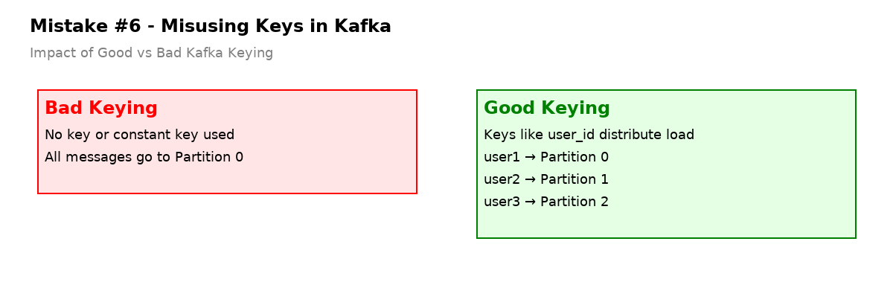

# Mistake #6 — Misusing Keys (Causing Data Skew or Out-of-Order Processing)



Kafka partitions data based on the **message key**.  
If your keys aren’t chosen wisely, you can easily cause:

- Data skew (all messages go to one partition)
- Out-of-order events
- Processing bottlenecks
- Increased consumer lag

---

## The Problem

Many developers don’t assign a key — or assign the **wrong key** — when producing messages.

### Examples of bad keying:

```bash
# No key — random partitioning (hard to join/group later)
producer.send(new ProducerRecord<>("user-activity", null, value))

# Constant key — all events land in one partition
producer.send(new ProducerRecord<>("user-activity", "all-users", value))
```

This leads to:

- Hot partitions that slow down brokers
- Parallelism breakdown (some consumers idle, one overloaded)
- Out-of-order delivery when partition consistency breaks

---

## Why It Happens

Kafka relies on hashing the **key** to determine the partition.  
If no key is provided, Kafka uses a round-robin partitioner.  
If the key is constant, all messages go to a single partition.

In streaming apps (Kafka Streams, Flink, etc.), partition = unit of parallelism.

Bad keying breaks:

- Join alignment (events don’t land in same partition)
- Stateful aggregations (data spread unpredictably)
- Ordering guarantees (required for time-sensitive apps)

---

## How to Avoid / Fix It

### 1. Always Use a Meaningful Key

Choose a key that:

- Ensures data with same entity lands on same partition
- Distributes load evenly across partitions

```bash
# Good: Key by user ID
producer.send(new ProducerRecord<>("user-activity", "user-123", value))

# Good: Key by product SKU
producer.send(new ProducerRecord<>("stock-events", "SKU-8892", value))
```

---

### 2. Avoid Constant or Null Keys

Never use a constant or `null` key unless you know what you’re doing.

- Null key → round-robin (non-deterministic)
- Same key → all events go to same partition (hotspot risk)

```bash
# Bad: Constant key leads to partition hotspot
producer.send(new ProducerRecord<>("orders", "all-orders", value))
```

---

### 3. Test Distribution Across Partitions

Before production rollout, inspect how your messages are being routed.

Use CLI or monitoring to check:

```bash
kafka-run-class kafka.tools.GetOffsetShell --broker-list <BROKER> --topic my-topic --time -1
```

Or in code:

```java
int partition = producer.partitioner().partition("user-123", ...);
System.out.println("Message routed to partition: " + partition);
```

Monitor partition sizes in Prometheus, JMX, or Grafana.

---

### 4. Design for Join & Aggregation Alignment

If using stream processing (Kafka Streams, Flink), align keys:

- Same key for both sides of join  
- Same keying logic for all topics involved  
- Validate shuffling behavior doesn’t break ordering

```java
KStream<String, Click> clicks = builder.stream("clicks");
KStream<String, Purchase> purchases = builder.stream("purchases");

clicks.join(purchases, ...)
```

Without proper keying, joins fail or require expensive repartitions.

---

## TL;DR

Kafka keys matter. A lot.

They decide:

- Where your data lands  
- How fast it processes  
- Whether your stateful apps work or break

Pick keys carefully.

---

## References

- [Kafka Partitions and Keys – Official Docs](https://kafka.apache.org/documentation/#producerconfigs_partitioner)
- [Confluent – Choosing Keys in Kafka](https://www.confluent.io/blog/put-semantics-into-kafka-keys/)
- [Understanding Kafka Streams Key Repartitioning](https://developer.confluent.io/learn-kafka/kafka-streams/repartitioning/)
- [Kafka Monitoring with Prometheus](https://github.com/danielqsj/kafka_exporter)

> "The key is the key to good Kafka design."
